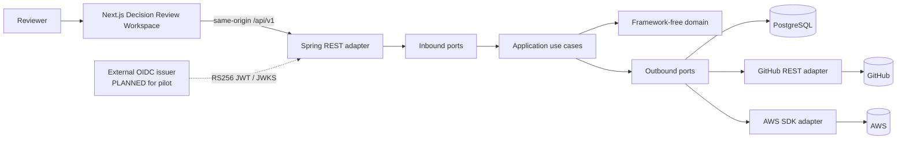

# IMPERATOR

### Enterprise Decision Intelligence Platform

> A security-first platform that turns operational evidence into explainable,
> measurable and auditable business decisions.

**Java 21 · Spring Boot 4.1 · PostgreSQL 18 · Next.js 16 · TypeScript · JWT/RBAC · Hexagonal Architecture · Docker · DevSecOps**

Portfolio focus: **Software Architecture · Cloud Security · DevSecOps · Auditability**

[](https://github.com/Dmillan-dev/ImperatorProyect/actions/workflows/java-ci.yml)
[](https://github.com/Dmillan-dev/ImperatorProyect/actions/workflows/security.yml)


[Technical evidence](docs/portfolio/technical-evidence.md) |
[Security](SECURITY.md) |
[Architecture decisions](docs/decisions/14_Decision_Log.md) |
[Synthetic demo](output/commercial/linkedin-discovery-kit/README.md) |
[Recruiter summary](docs/portfolio/recruiter-summary.md)

## 30-Second Overview

IMPERATOR reconstructs why an operational decision was made, which evidence
supported it, who approved it and whether the expected economic result was
later realized. The current MVP proves one bounded case, `DRC-AOA-001`, through
a Java/Spring modular monolith, PostgreSQL, a secured REST API and a Next.js
Decision Review Workspace.

The project demonstrates secure software design rather than autonomous AI:
recommendations and ROI are deterministic, human authority remains explicit,
and the append-only Decision Ledger preserves accountability.

| At a glance | Repository evidence |
|---|---|
| Business flow | Evidence → Decision → Recommendation → Human Review → Ledger → Business Value |
| Architecture | Java modular monolith with framework-free Domain/Application and hexagonal ports/adapters |
| Security | RS256 JWT, explicit four-role RBAC, Evidence redaction, read-only cloud integrations and append-only audit history |
| Verification | 151 backend tests, 34 PostgreSQL integration tests, 41 frontend tests and Playwright browser acceptance |
| Current boundary | Pre-pilot; Sprint 4.3 Docker Production Runtime is certified, while external pilot identity remains deferred before Sprint 4.5 |


> The screenshot uses synthetic test fixtures. It is not customer data and does
> not claim realized customer savings.

## Verified Delivery Status

Status labels in this repository have strict meanings:

| Label | Meaning |
|---|---|
| **[IMPLEMENTED]** | Code exists and its focused tests pass |
| **[PARTIALLY IMPLEMENTED]** | A bounded implementation exists, but its complete runtime or external gate is not certified |
| **[PLANNED]** | A contract or preparation artifact exists; implementation does not |
| **[FUTURE]** | Direction only; no current implementation claim |

| Capability | Status | Evidence |
|---|---|---|
| Hexagonal Java domain and application | **[IMPLEMENTED]** | Framework-free Domain/Application, inbound/outbound ports and adapter isolation |
| Evidence-to-value business loop | **[IMPLEMENTED]** | Deterministic local `DRC-AOA-001` flow with synthetic data |
| PostgreSQL persistence and Flyway | **[IMPLEMENTED]** | JDBC adapters, constraints, transactions and real PostgreSQL integration tests |
| REST API | **[IMPLEMENTED]** | 15 D086 route/method contracts plus D093 R16, with typed errors and correlation IDs |
| JWT and RBAC | **[IMPLEMENTED]** | RS256/JWKS Resource Server, four exact roles and evidence redaction |
| GitHub evidence connector | **[IMPLEMENTED]** | Read-only REST adapter for one organization/repository; live sandbox smoke test remains pending |
| AWS evidence connector | **[IMPLEMENTED]** | Read-only STS, Cost Explorer, tagging and CloudWatch adapter; live sandbox smoke test remains pending |
| Decision Review Workspace | **[IMPLEMENTED]** | Next.js/React single-case workspace with strict response validation |
| Docker production-like runtime | **[IMPLEMENTED]** | D092-D095 certified hardened Compose, SHA-tagged images, PostgreSQL 18.6 supply-chain evidence and persistence after recreation |
| External OIDC identity provider | **[PLANNED]** | Keycloak pilot integration is designed but not provisioned or connected |
| D093 case-composition route | **[IMPLEMENTED]** | `ADMIN`-only R16 composes the canonical Decision and Recommendation through existing Application boundaries |
| Application metrics, traces and dashboards | **[PLANNED]** | Sprint 4.4 preparation only |
| Python/FastAPI explanation service | **[FUTURE]** | Directory boundary only; no Python source or provider calls |
| Kubernetes, Terraform, Kafka and Redis | **[FUTURE]** | Explicitly excluded from the MVP |

Current formal state: **Phase 3, pre-pilot; Sprint 4.3 and its documentation
synchronization are complete, and Sprint 4.4 Observability is the sole next
gate.** D095 defers operational Keycloak HTTPS conformance without weakening
D087/D088; it remains mandatory before Sprint 4.5, real customer data or MVP
Release. See the [pilot status](docs/pilot/README.md) and
[D095](docs/decisions/14_Decision_Log.md).

## Why IMPERATOR?

Operational decisions are usually fragmented across tickets, pull requests,
cloud billing, monitoring and human approvals. Months later, teams can often
see what changed but cannot reliably answer:

- which evidence was available at decision time;
- who had authority to approve the action;
- which assumptions produced the ROI estimate;
- whether implementation actually occurred; or
- whether the expected value was realized.

IMPERATOR models that chain as a single auditable decision lifecycle. It does
not execute infrastructure changes and it does not allow an LLM to become the
decision authority.

## Key Capabilities

- **Decision traceability:** Evidence, Recommendation, human action, Ledger and
  outcome remain connected.
- **Deterministic recommendation policy:** the same eligible evidence produces
  the same recommendation and ROI result.
- **Estimated versus realized value:** projected savings never become Business
  Value until implementation and financial result validation are recorded.
- **Append-only accountability:** corrections are new Ledger entries, not
  mutations of history.
- **Provider-neutral evidence:** GitHub, AWS and JSONL import normalize into the
  same domain evidence model.
- **Human governance:** the company approves, rejects, defers, marks
  implementation and validates results.

## Architecture



Dependency direction is inward: API, persistence and provider adapters depend
on Application/Domain contracts; the Domain imports no Spring, JDBC, JPA,
REST, AWS or GitHub types.

Detailed diagrams and evidence are in
[Technical Evidence](docs/portfolio/technical-evidence.md).

## Decision Lifecycle

```mermaid
flowchart LR
    Event[Operational event] --> Evidence[Normalized Evidence]
    Evidence --> Decision[Decision]
    Decision --> Recommendation[Recommendation + ROI]
    Recommendation --> Review[Human review]
    Review --> Ledger[Append-only Ledger]
    Ledger --> Implementation[Implementation marked]
    Implementation --> Validation[Result validation]
    Validation --> Value[Realized Business Value]
```



The implemented local proof uses 30 synthetic Evidence records. Live connector
evidence and the D093/R16 case-composition route are implemented; operational
external-IdP and live-provider conformance remain pre-pilot obligations.

## Security Architecture

Implemented controls include:

- Spring Security OAuth2 Resource Server; RS256 only;
- exact issuer, audience, expiry, `kid`, subject and role validation;
- one role per token: `ADMIN`, `PLATFORM_ENGINEER`, `FINANCE` or `AUDITOR`;
- explicit route/method authorization and server-side governance checks;
- Confidential evidence redaction and fail-closed Restricted evidence;
- volatile browser token handling with no local/session storage;
- read-only GitHub and AWS connector permissions;
- no raw provider payload persistence;
- file-backed Docker secrets excluded from Git;
- digest-pinned third-party images, non-root application containers,
  read-only filesystems, capability dropping and loopback-only exposure.

Known boundaries are equally important:

- no external IdP is currently connected;
- the token-paste frontend bootstrap is pre-pilot, not production login;
- there is no tenant entitlement model;
- external Keycloak issuer/JWKS conformance remains mandatory before Sprint 4.5;
- D094 replaces the vulnerable upstream `gosu` binary through a pinned,
  reproducible and independently scanned PostgreSQL 18.6 image;
- application SAST, Java SCA and production incident response are not yet
  automated.

See [Security Policy](SECURITY.md) and the canonical
[Threat Model](docs/architecture/26_Security_Data_Governance_Threat_Model.md).

## DevSecOps Evidence

| Control | Current state |
|---|---|
| GitHub Actions Java build | **IMPLEMENTED**; minimal `contents: read` permission and actions pinned by commit SHA |
| Maven runtime enforcement | **IMPLEMENTED**; exact Maven 3.9.16 and Java 21 boundary |
| Compiler warnings as errors | **IMPLEMENTED** |
| Backend unit/API/security tests | **IMPLEMENTED**; 151 default tests |
| PostgreSQL integration gate | **IMPLEMENTED**; 34 real-database tests plus Flyway migrate/validate/idempotency |
| Frontend lint/typecheck/tests/build | **IMPLEMENTED locally**; 41 tests and production build pass |
| Frontend dependency audit | **IMPLEMENTED as a manual certification command**; latest local check found 0 vulnerabilities |
| Automated source/dependency scan | **IMPLEMENTED**; the fail-closed hosted Trivy workflow scans dependencies, secrets and configuration and is passing |
| Application container vulnerability gate | **IMPLEMENTED**; hosted backend and frontend image scans fail on fixable High/Critical findings and are passing |
| PostgreSQL supply-chain gate | **IMPLEMENTED / D094 PASS**; two reproducible builds, pinned inputs, SBOM, provenance and hosted Trivy scanning verify zero fixable High/Critical findings and zero secrets |
| Frontend CI workflow | **PLANNED** |
| Automated SAST | **PLANNED**; Java and npm SCA are covered by the Trivy workflow |
| Deployment pipeline | **FUTURE**; no cloud deployment exists |

The current CI is intentionally smaller than the target pipeline. The
repository does not claim that planned security automation already runs.

## Cloud Engineering Scope

**Implemented integration, not deployment:** IMPERATOR uses the AWS SDK through
a bounded read-only Evidence adapter. It verifies the expected account with
STS and reads the minimum contracted Cost Explorer, Resource Groups Tagging API
and CloudWatch data for one account, one Region and one tagged workload.

| AWS API | MVP purpose | Security and cost boundary |
|---|---|---|
| STS | Confirm the caller belongs to the configured account | Read-only identity check; account mismatch fails closed |
| Cost Explorer | Collect the bounded monthly cost fact | One contracted time window; no billing mutation |
| Resource Groups Tagging API | Resolve resources belonging to the workload | Exact account, Region and correlation tags |
| CloudWatch | Collect the contracted utilization signal | Bounded query surface, timeout and response limits |

The repository contains no AWS deployment, IAM provisioning, Terraform,
Kubernetes or multi-account control plane. GitHub is likewise a read-only
evidence source, not a deployment platform for the application.

The single-account, single-Region scope is deliberate: it keeps permissions,
API usage and cost attribution reviewable before any multi-account scaling
model exists.

## Technology Stack

| Area | Implemented | Planned or future |
|---|---|---|
| Backend | Java 21, Spring Boot 4.1, Maven 3.9.16 | None required for current MVP |
| Architecture | Hexagonal Architecture, DDD boundaries, modular monolith, light CQRS reads | Broader read models after MVP evidence |
| Data | PostgreSQL 18.x, JDBC, Flyway 13 | Multi-tenant persistence after product validation |
| API and security | REST, OAuth2 Resource Server, JWT RS256, RBAC, Zod client validation | External Keycloak pilot configuration |
| Integrations | GitHub REST, AWS SDK, JSONL Evidence import | Additional connectors after MVP |
| Frontend | Next.js 16, React 19, TypeScript 5, Tailwind CSS 4 | Production login/session UX |
| Runtime | Docker Compose, hardened multi-stage images | Cloud deployment after pilot |
| Observability | Correlation IDs, safe errors, container health checks/log rotation | Structured application logs, OpenTelemetry, metrics and dashboards |
| AI | Provider-neutral Java `ExplanationProvider` port | Python/FastAPI and real providers are future work |

## REST API

The implemented surface contains the 15 D086 route/method pairs plus the D093
R16 composition route under `/api/v1`:

```text
POST /evidence/import
POST /decisions
GET  /decisions
GET  /decisions/{id}
GET  /decisions/{id}/timeline
GET  /decisions/{id}/evidence
GET  /decisions/{id}/roi
GET  /recommendations/{id}
GET  /decisions/{id}/ledger
POST /decisions/{id}/ledger/approve
POST /decisions/{id}/ledger/reject
POST /decisions/{id}/ledger/defer
POST /decisions/{id}/ledger/mark-implemented
POST /decisions/{id}/ledger/validate-result
GET  /business-value
GET  /ledger
```

No public connector trigger, GraphQL API or autonomous execution endpoint is
implemented. The conceptual API and transport rules live in
[API Specification](docs/product/API_SPECIFICATION.md) and
[D086](docs/architecture/45_Functional_REST_Application_Contract.md).

## Testing

Verified at the current implementation boundary:

- 151 backend default tests covering Domain, Application, connectors, REST,
  JWT and RBAC;
- 34 PostgreSQL integration tests covering repositories, transactions, Flyway,
  REST composition and connector persistence;
- 41 frontend unit/component tests;
- strict TypeScript, ESLint with zero warnings and production Next.js build;
- certified Playwright coverage across desktop, compact and mobile viewports;
- negative cases for invalid JWTs, forbidden roles, redaction, duplicate import,
  transaction rollback, concurrency and append-only Ledger sequencing.

## Observability And Auditability

These concerns have different maturity levels:

- **Auditability is implemented:** immutable Ledger facts retain Decision,
  actor, timestamp, reason and Evidence relationships; PostgreSQL constraints
  protect ordering and referential integrity.
- **Operational diagnostics are partially implemented:** HTTP correlation IDs,
  typed non-sensitive errors, container health checks and bounded Docker log
  rotation exist.
- **Observability is planned:** structured application logs, metrics,
  OpenTelemetry traces, alert rules and Grafana dashboards are preparation
  work only and are not part of the current runtime.

There is no public TLS endpoint or encryption-at-rest claim. The current
runtime is local and loopback-bound; pilot TLS, external identity, backup and
secret-management controls must be certified before customer data is allowed.

## Repository Structure

```text
.github/         Java CI and repository governance
backend-java/    Domain, Application, ports, adapters, API and bootstrap
backend-python/  Reserved future AI explanation boundary; no Python code
database/        Flyway migrations
docs/            Contracts, decisions, evidence and project control
frontend/        Certified Decision Review Workspace
infra/docker/    Implemented production-like Compose runtime
proto/           Contract artifacts only; no generated runtime
samples/         Synthetic validation material
scripts/         Docker verification and commercial artifact generation
```

See [Repository Structure](docs/architecture/structure.md) for ownership and
mutation rules.

## Engineering Decisions

- **Hexagonal architecture:** protects business rules from HTTP, persistence
  and provider SDKs.
- **Modular monolith:** preserves clear boundaries without premature
  distributed-system overhead.
- **PostgreSQL from the first executable slice:** the Decision Ledger requires
  durable constraints and transactional behavior.
- **JDBC adapters instead of domain persistence annotations:** PostgreSQL adapts
  to the Domain, never the reverse.
- **Deterministic policy before AI explanation:** deleting every AI provider
  must not break recommendation or ROI behavior.
- **Append-only Ledger:** history represents facts, not mutable CRUD state.
- **Digest pinning and fail-closed release gates:** reproducibility and security
  take precedence over declaring an early PASS.

The full, append-only decision history is in the
[Decision Log](docs/decisions/14_Decision_Log.md).

## Local Verification

Backend prerequisites: Java 21 and the Maven Wrapper included in this
repository.

```powershell
.\mvnw.cmd clean verify
```

Real PostgreSQL integration requires the six `IMPERATOR_IT_*` variables
documented in [backend-java/README.md](backend-java/README.md):

```powershell
.\mvnw.cmd -Ppostgresql-integration clean verify
```

Frontend prerequisites: Node.js 24 LTS and npm 11.

```powershell
cd frontend
npm ci
npm run lint
npm run typecheck
npm test
$env:IMPERATOR_API_ORIGIN = "http://127.0.0.1:8080"
npm run build
```

The certified Docker runtime has external issuer and local secret
preconditions. Follow [infra/docker/README.md](infra/docker/README.md). D095
separates its completed local certification from the operational external-IdP
conformance required before Sprint 4.5.

## Example Use Case

The synthetic MVP case evaluates recurring AI onboarding-assistant cost:

```text
30 normalized Evidence records
-> deterministic Decision DRC-AOA-001
-> lower-cost model Recommendation
-> explicit ROI assumptions and confidence
-> authorized human review
-> append-only approval and implementation history
-> independent financial result validation
-> realized Business Value projection
```

The reference estimate is synthetic. IMPERATOR never presents estimated value
as realized value until validation evidence exists.

## Roadmap

| Stage | Scope |
|---|---|
| **Completed** | Core Domain, Application use cases, PostgreSQL, REST, JWT/RBAC, GitHub/AWS evidence adapters, D093 composition, Decision Review Workspace and Docker Production Runtime |
| **Next** | Sprint 4.4 Observability contract, implementation and certification |
| **Planned** | External Keycloak pilot conformance and Sprint 4.5 Pilot Readiness |
| **Future** | Python explanation service, more connectors, multi-tenancy, cloud deployment, Terraform, Kubernetes, Kafka and Redis only when justified |

## Post-MVP DevSecOps Path

This is a delivery sequence, not an implementation claim. Sprint 4.4
Observability, external Pilot Identity Conformance and Pilot Readiness retain
precedence over this path.

```mermaid
flowchart LR
    MVP[Certify local MVP runtime] --> CI[CI hardening]
    CI --> Security[SAST + SCA + container scan]
    Security --> Artifact[Versioned images + SBOM + provenance]
    Artifact --> IaC[Terraform AWS foundation]
    IaC --> ECS[ECR + ECS/Fargate + RDS]
    ECS --> Operations[CloudWatch + CloudTrail + backup/restore]
    Operations -. only with measured need .-> EKS[EKS / Kubernetes]
```



| Stage | Status | Bounded outcome |
|---|---|---|
| Docker Production Runtime | **[IMPLEMENTED]** | D092-D095 certification, D093/R16, D094 supply-chain evidence, local JWT/RBAC E2E and persistence after recreation pass |
| CI hardening | **[PARTIALLY IMPLEMENTED]** | Java CI, Docker builds, Trivy gates and D094 SBOM/provenance are active; frontend CI, dedicated SAST and Java SCA remain planned |
| AWS deployment contract | **[FUTURE]** | Freeze workload, data, IAM, network, TLS, backup, recovery, logging, cost and threat-model requirements before provisioning |
| Terraform AWS foundation | **[FUTURE]** | Provision only the contracted VPC, private networking, IAM, security groups, ECR, ECS/Fargate, RDS, Secrets Manager, CloudWatch and CloudTrail resources |
| Kubernetes variant | **[FUTURE / CONDITIONAL]** | Consider EKS, Helm, NetworkPolicy and GitOps only if scaling or platform requirements justify their operational cost |

Terraform and AWS deployment belong to one future delivery capability:
infrastructure is designed, reviewed, provisioned and validated together. A
Terraform directory alone is not treated as cloud-engineering evidence.

## Security Disclosure

Please do not report vulnerabilities through a public issue. Follow
[SECURITY.md](SECURITY.md) for private reporting and handling expectations.

## Public Repository Boundary

This portfolio repository contains source code, architecture records and
synthetic fixtures only. Real credentials, JWTs, private keys, customer data,
database dumps, local `.env` files and generated runtime evidence are excluded
from Git. `infra/docker/.env.example` contains non-routable placeholders; local
Docker secret values remain under the ignored `infra/docker/secrets/` path.

The committed commercial screenshots and deck use synthetic data and are
curated separately from ignored local PDF exports and private discovery notes.

## License

Copyright (c) 2026 Daniel Millan Perez. This repository is publicly available
for portfolio review under a proprietary, all-rights-reserved license. See
[LICENSE](LICENSE).
