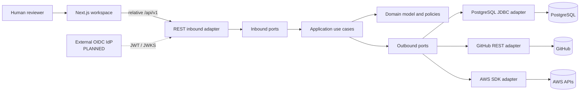
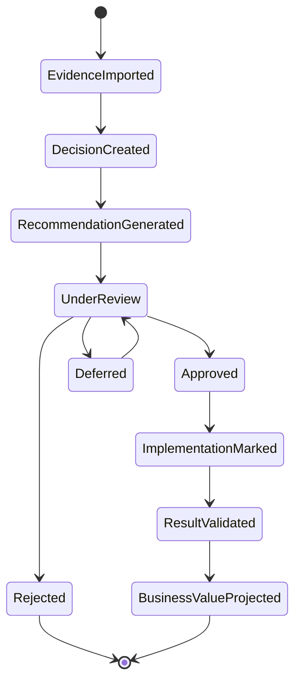
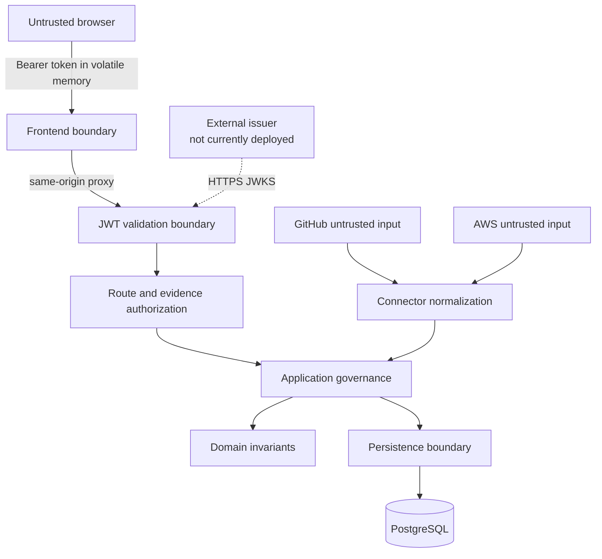
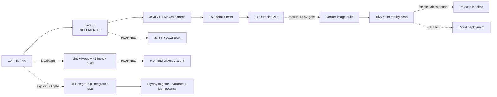
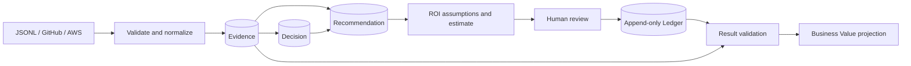

# IMPERATOR Technical Evidence

Status: **Portfolio view of the current repository; non-authoritative**

This document helps a technical reviewer validate what IMPERATOR demonstrates.
It links to canonical contracts and implementation instead of replacing them.

## Status Vocabulary

| Status | Required evidence |
|---|---|
| **[IMPLEMENTED]** | Source exists and focused verification passes |
| **[PARTIALLY IMPLEMENTED]** | Source exists, but a complete runtime or external certification gate remains open |
| **[PLANNED]** | Design or contract exists without runtime implementation |
| **[FUTURE]** | Direction only; not part of the current MVP |

## Implementation Inventory

| Area | Status | Repository evidence |
|---|---|---|
| Hexagonal architecture | **[IMPLEMENTED]** | `backend-java/domain`, `application`, `ports`, `adapters`, `api` and `bootstrap` |
| Domain purity | **[IMPLEMENTED]** | Domain/Application/ports contain no Spring, JDBC, JPA, AWS or HTTP imports |
| Deterministic decision policy | **[IMPLEMENTED]** | `DrcAoa001RecommendationPolicy` and focused tests |
| Human governance | **[IMPLEMENTED]** | Review and Ledger use cases plus Application-level authority checks |
| Append-only Ledger | **[IMPLEMENTED]** | Domain invariant, append-only repository contract and PostgreSQL constraints |
| Business Value | **[IMPLEMENTED]** | Read projection derived from result-validated Ledger facts; not a mutable entity |
| PostgreSQL | **[IMPLEMENTED]** | JDBC repositories, mappers, transaction runner and Flyway V1/V2 |
| REST API | **[IMPLEMENTED]** | Six controllers implementing the 15 D086 route/method pairs plus D093 R16 |
| JWT authentication | **[IMPLEMENTED]** | RS256 Resource Server with exact issuer, JWKS, audience, time, `kid`, subject and role validation |
| RBAC authorization | **[IMPLEMENTED]** | Four roles, explicit route matrix and evidence redaction |
| GitHub integration | **[IMPLEMENTED]** | Read-only bounded REST adapter with timeout, retry, rate-limit and same-origin redirect controls |
| AWS integration | **[IMPLEMENTED]** | Read-only AWS SDK adapter bounded to one account, Region and workload |
| Frontend | **[IMPLEMENTED]** | Next.js/React workspace with same-origin API transport and strict Zod validation |
| Docker runtime | **[IMPLEMENTED]** | D092-D095 hardened Compose, reproducible PostgreSQL 18.6 image and persistence/recreation certification pass |
| External IdP | **[PLANNED]** | Keycloak preparation exists; no issuer is deployed or connected |
| D093/R16 composition | **[IMPLEMENTED]** | `ADMIN`-only API composition, resumable D081/D082 steps and case uniqueness are certified |
| Observability | **[PLANNED]** | Correlation and container health exist; metrics, tracing and dashboards do not |
| Python/FastAPI | **[FUTURE]** | Documentation boundary only |
| Cloud deployment | **[FUTURE]** | No AWS-hosted runtime, Terraform or Kubernetes exists |

## Reviewer Code Walkthrough

| Concern | Start here |
|---|---|
| Domain decision policy | [`DrcAoa001RecommendationPolicy.java`](../../backend-java/domain/decision/DrcAoa001RecommendationPolicy.java) |
| Decision aggregate | [`Decision.java`](../../backend-java/domain/decision/Decision.java) |
| Append-only history | [`LedgerEntry.java`](../../backend-java/domain/ledger/LedgerEntry.java) and [`PostgresLedgerRepository.java`](../../backend-java/adapters/out/postgresql/PostgresLedgerRepository.java) |
| JWT boundary | [`JwtResourceServerConfiguration.java`](../../backend-java/api/security/JwtResourceServerConfiguration.java) and [`JwtContractValidator.java`](../../backend-java/api/security/JwtContractValidator.java) |
| Evidence visibility | [`DecisionEvidenceAuthorizationPolicy.java`](../../backend-java/api/decisions/DecisionEvidenceAuthorizationPolicy.java) |
| GitHub integration | [`GitHubRestAdapter.java`](../../backend-java/adapters/out/github/GitHubRestAdapter.java) |
| AWS integration | [`AwsSdkEvidenceSourceAdapter.java`](../../backend-java/adapters/out/aws/AwsSdkEvidenceSourceAdapter.java) |
| Database schema | [`V1__initial_schema.sql`](../../database/migrations/V1__initial_schema.sql) |
| Frontend workspace | [`decision-review-workspace.tsx`](../../frontend/features/decision-review/decision-review-workspace.tsx) |
| Java CI | [`java-ci.yml`](../../.github/workflows/java-ci.yml) |
| Docker runtime | [`compose.yaml`](../../infra/docker/compose.yaml) |

## A. High-Level Architecture

**Engineering signal:** business rules live inside Domain/Application and do
not depend on frameworks or provider SDKs. Infrastructure implements ports.

## B. Decision Lifecycle

Every governance transition is protected in the Application/Domain boundary.
The frontend cannot manufacture a valid transition.

## C. Security Boundaries

Trust is not inferred from a frontend role label or connector payload. JWT
validation, route authorization, Application authority and Domain invariants
are separate checks.

## D. DevSecOps Pipeline

Solid lines are automated in the current Java workflow. Dotted lines are local,
manual, planned or future and are explicitly labelled.

## E. Evidence and Data Flow

Provider payloads are not business truth. The canonical Evidence model preserves
lineage while excluding raw payload persistence.

## Security Review

### Implemented Controls

| Control | Evidence |
|---|---|
| No tracked runtime secrets | `.gitignore`, file-backed Docker secrets and tracked-secret scan |
| Least privilege CI | GitHub Actions `contents: read` only |
| Pinned CI actions | Actions referenced by immutable commit SHA |
| Reproducible toolchain | Maven Wrapper checksum, Maven 3.9.16 and Java 21 enforcement |
| Strong API authentication | RS256 only, mandatory `kid`, exact audience/issuer and expiry validation |
| Explicit authorization | No role hierarchy; route/method matrix for four roles |
| Sensitive evidence handling | Confidential redaction and Restricted fail-closed behavior |
| Safe external calls | Read-only connectors, bounded responses, redirects, retries and timeouts |
| Data integrity | Database constraints, explicit transactions and append-only Ledger |
| Container hardening | Digest pins, non-root app images, read-only filesystems, dropped capabilities and loopback exposure |
| Browser token handling | Volatile memory only; no cookie/local/session storage |

### Current Risks and Gaps

| Severity | Finding | Treatment |
|---|---|---|
| High pilot prerequisite | No operational external issuer/JWKS is connected | Pass the D095-deferred Keycloak HTTPS conformance gate before Sprint 4.5 |
| Medium | Frontend quality gates are not yet in GitHub Actions | Add one focused frontend CI workflow in a separately authorized delivery iteration |
| Medium | No automated Java SCA or SAST | Select one SCA and one SAST control only after defining ownership, baseline and false-positive handling |
| Medium | Token paste is the current frontend bootstrap | Replace with separately contracted Authorization Code + PKCE login before real users |
| Medium | No tenant entitlement model | Keep runtime single-organization and prohibit customer exposure until a tenant contract exists |
| Medium | Structured application logs, metrics and traces are absent | Implement only under the future Observability gate |
| Low portfolio issue | Historical control documents and some folder READMEs lag current physical state | Keep canonical history immutable; correct active navigation documents when authorized |

No hard-coded GitHub token, AWS access key, private key or runtime password was
found in tracked source during this review. The latest executed `npm audit`
reported zero vulnerabilities. Java dependency SCA is not currently automated,
so this document makes no equivalent zero-vulnerability claim for Java.

## Architecture and Product Boundaries

- **Modular monolith, not microservices.** This keeps transaction and delivery
  complexity proportional to a one-case MVP.
- **JDBC persistence adapter, not JPA domain entities.** Persistence records and
  mappers are adapter-owned.
- **Light CQRS.** Write repositories remain minimal; dashboard reads use a
  dedicated projection port.
- **AI is optional explanation.** A provider outage must not change the
  deterministic recommendation, ROI or Ledger.
- **No autonomous execution.** Implementation is recorded after it occurs in an
  external system.
- **Single organization and case.** Multi-tenancy is not implied by future
  domain vocabulary.

## Verification Evidence

| Gate | Last verified result |
|---|---|
| Java runtime | Java 21.0.12 |
| Maven runtime | Maven 3.9.16 |
| Backend default suite | 151 passed |
| PostgreSQL suite | 34 passed |
| Flyway | migrate, validate and repeated migrate passed |
| Frontend unit/component suite | 41 passed |
| Frontend lint/typecheck/build | Passed |
| Frontend npm audit | 0 vulnerabilities |
| Sprint 4.3 container certification | **CERTIFIED / COMPLETE under D092-D095** |

Canonical execution evidence is maintained in
[`docs/project/PROJECT_STATUS.md`](../project/PROJECT_STATUS.md). D095 records
the separation between certified local runtime evidence and the mandatory
pre-pilot external identity gate.

## Canonical References

- [Core Domain Model](../product/CORE_DOMAIN_MODEL.md)
- [API Specification](../product/API_SPECIFICATION.md)
- [Architecture Thesis](../architecture/18_Architecture_Thesis.md)
- [Technical Architecture Context](../architecture/21_Technical_Architecture_Context.md)
- [Threat Model](../architecture/26_Security_Data_Governance_Threat_Model.md)
- [Quality Attributes](../architecture/27_Quality_Attributes.md)
- [Coding Principles](../architecture/35_Coding_Principles.md)
- [Implementation Contract](../architecture/37_Implementation_Contract.md)
- [JWT Contract](../architecture/46_JWT_Authentication_Contract.md)
- [RBAC Contract](../architecture/47_RBAC_Authorization_Contract.md)
- [Docker Runtime Contract](../architecture/51_Docker_Production_Runtime_Contract.md)
- [Decision Log](../decisions/14_Decision_Log.md)
