# 23 — IMPERATOR Visual Operational Explainer

## Purpose

This document explains IMPERATOR in a didactic and operational way.

It is designed for:
- founder storytelling,
- customer discovery calls,
- investor explanation,
- internal alignment,
- future product and engineering onboarding.

It is not a technical implementation plan.

Canonical sources:
- `docs/product/20_MVP_Decision_ROI_Platform_Blueprint.md`
- `docs/product/24_MVP_Vertical_Slice.md`
- `docs/product/25_MVP_ROI_Slice.md`
- `docs/product/26_Manual_Evidence_Pack_AI_Onboarding_Assistant.md`
- `docs/product/27_MVP_Acceptance_Test_Plan.md`
- `docs/product/28_Identity_Access_Approval_Model.md`
- `docs/product/29_Decision_Review_Workspace_Screen_Contract.md`
- `docs/product/CORE_DOMAIN_MODEL.md`
- `docs/product/DECISION_LEDGER_V2.md`
- `docs/business/16_Sales_Narrative_and_Commercial_Case.md`
- `docs/architecture/21_Technical_Architecture_Context.md`
- `demos/executive_dashboard_demo/`

## One-Sentence Explanation

**IMPERATOR is an Operating System for Operational Intelligence: it manages decisions across cloud, code, AI and business systems.**

Shorter version:

**One Decision. One Timeline. One ROI.**

## Category Positioning

Use this comparison when explaining the category:

| Existing category | What it manages |
|---|---|
| ERP | Resources |
| CRM | Customers |
| SIEM | Security |
| Observability | Systems |
| IMPERATOR | Decisions |

Commercial category:

**Enterprise Decision Intelligence Platform**

MVP product model:

**Decision ROI Platform for Executive Operational Intelligence**

## What Problem It Solves

Companies make business decisions in one place, implement them in another, and pay for them somewhere else.

After launch, the economic thread disappears.

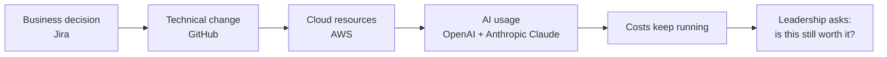

Without IMPERATOR, answering that question requires manual reconstruction across teams and systems.

## Full Platform Picture

The long-term platform connects operating systems of record to the decision layer.

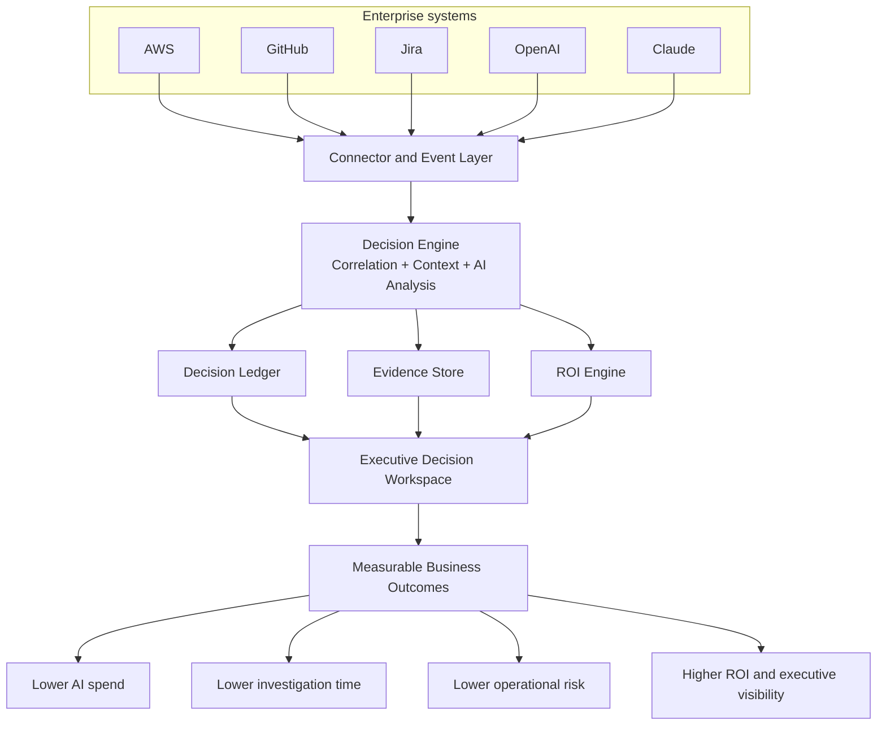

## What IMPERATOR Does

IMPERATOR turns scattered operational signals into one reviewable business object:

**Decision ROI Case**

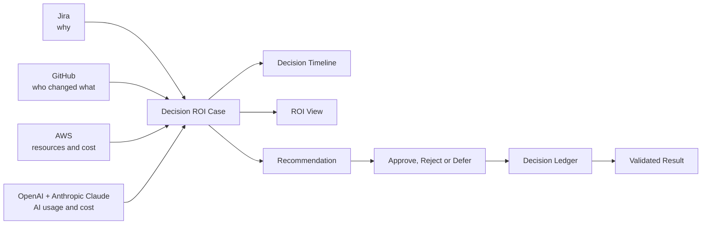

The product answer is:

> This decision costs X today, appears to create Y estimated value, and has an action that can recover Z per year.

## The MVP in One Picture

The MVP is not a broad platform yet.

It is a narrow paid workflow:

**Decision Recovery Workflow for AI/cloud spend**

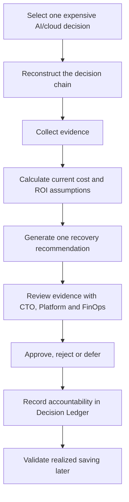

MVP promise:

**In 30 days, reconstruct one expensive AI/cloud decision and produce one approval-ready recovery action.**

## Minimum MVP Demonstration

For a TFG or first startup proof, the MVP should demonstrate only this end-to-end path:

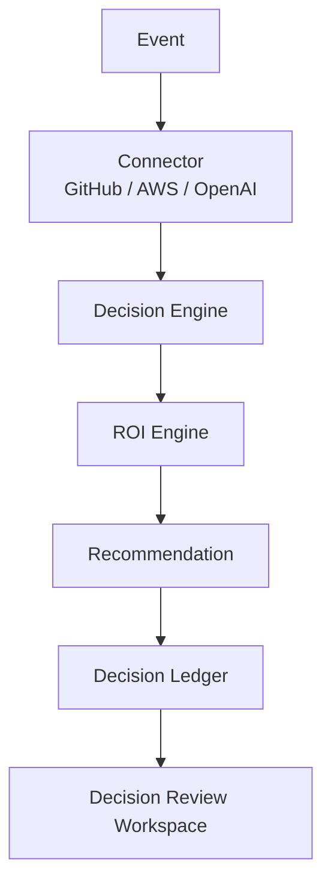

If this flow works end to end, IMPERATOR has a defensible MVP: a real event becomes a reviewed decision, the ROI is explainable, the decision is recorded, and the product surface shows financial impact.

In this explainer, `Decision Engine` means the product capability that correlates events, builds context and prepares a recommendation. It does not require a separate implementation service during Phase 0 or the first proof.

The Decision Ledger records the reviewed recommendation and the later outcome. It preserves ROI, evidence and assumptions snapshots; it is not the ROI calculator.

## The Story to Tell

Use this example when explaining the product.

### 1. The Company Approved a Feature

Product approved a Jira ticket:

**Create an AI assistant for customer onboarding.**

### 2. Engineering Shipped It

Engineering implemented the feature through GitHub and deployed it on AWS Lambda.

### 3. The Feature Uses AI

The assistant uses a high-cost model through OpenAI or Anthropic Claude.

### 4. The Cost Keeps Running

Forty-two days later, Finance asks:

**Is this assistant worth what it costs?**

### 5. IMPERATOR Rebuilds the Answer

IMPERATOR reconstructs:
- why the feature exists,
- who implemented it,
- what infrastructure it uses,
- what AI it consumes,
- what it costs now,
- whether usage supports the cost,
- what action leadership should approve.

Example output:

| Question | Answer |
|---|---|
| What decision are we reviewing? | AI Onboarding Assistant |
| Current monthly cost | EUR2,340/month |
| Usage signal | 17 active users |
| Main issue | High-cost AI model for low-complexity workload |
| Recommendation | Change to lower-cost model |
| Estimated saving | EUR1,620/month |
| Annualized recovery | EUR19,440/year |
| Approval owner | CTO |
| Record | Decision Ledger entry |

## The Operational Flow

This is how IMPERATOR works conceptually.

```mermaid
flowchart LR
    A[External platforms] --> B[Capture signals]
    B --> C[Normalize events]
    C --> D[Correlate evidence]
    D --> E[Build Decision ROI Case]
    E --> F[Calculate ROI]
    F --> G[Recommend action]
    G --> H[Human review]
    H --> I[Decision Ledger]
    I --> J[Validate result]
```

Plain-language version:

| Step | What happens | Why it matters |
|---|---|---|
| 1. Capture | IMPERATOR reads selected signals from Jira, GitHub, AWS and AI usage. | The evidence already exists, but it is scattered. |
| 2. Normalize | Provider-specific data becomes common business context. | Jira issues and AWS costs can be discussed in the same decision language. |
| 3. Correlate | Signals are linked to one Decision ROI Case. | The product does not review isolated logs, it reviews one business decision. |
| 4. Evaluate ROI | Cost, usage and assumptions are made explicit. | Leadership can trust the number and challenge the assumptions. |
| 5. Recommend | IMPERATOR proposes one recovery action. | The output is operational, not just analytical. |
| 6. Review | CTO or VP Engineering approves, rejects or defers after Business Owner, Platform and FinOps review. | The company decides; IMPERATOR does not execute autonomously. |
| 7. Record | The ledger preserves evidence, ROI and approval history. | Accountability survives beyond the meeting. |
| 8. Validate | Realized saving is checked later. | Estimated value and realized value stay separate. |

## MVP Information Domains

The MVP uses four domains, not unlimited connectors.

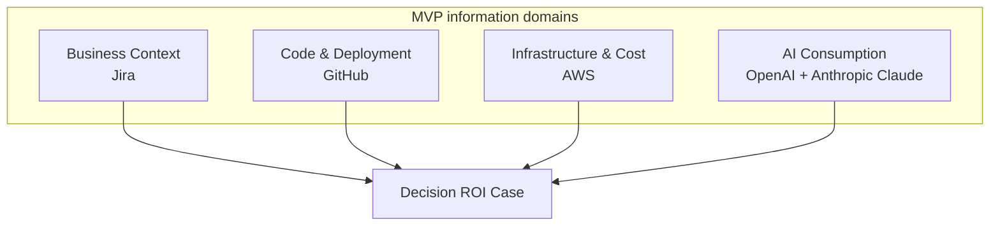

| Domain | Initial system | Question answered |
|---|---|---|
| Business Context | Jira | Why does this decision exist? |
| Code & Deployment | GitHub | Who implemented it and what changed? |
| Infrastructure & Cost | AWS | What resources does it consume and what does it cost? |
| AI Consumption | OpenAI + Anthropic Claude | Which models, tokens, users and applications drive AI spend? |

## MVP Recommendation Focus

IMPERATOR should not build five recommendation engines at once.

For the MVP, focus on one paid-wedge recommendation:

| Priority | Recommendation | MVP role |
|---|---|---|
| 5/5 | Downgrade or change AI model | Primary |

Expansion candidates after repeatable ROI is proven:
- remove unused AI agents,
- detect underutilized AWS resources tied to the same decision,
- negative-ROI feature analysis,
- duplicated service or agent consolidation.

## How the Demo Explains the Product

The demo is useful as a future-state product story, but the MVP should focus first on the **Decision Review Workspace**.

Demo folder:
- `demos/executive_dashboard_demo/`

### Demo Navigation Map

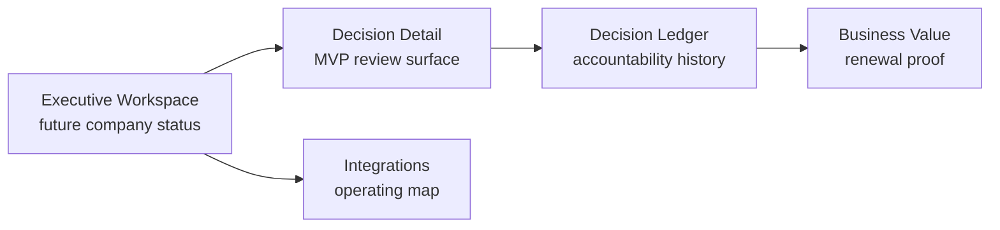

| Demo screen | Product question | MVP status |
|---|---|---|
| Executive Workspace | How is the company right now? | Expansion surface after multiple Decision ROI Cases |
| Decision Detail | Can we trust and approve this recovery action? | MVP commercial surface |
| Decision Ledger | What has the company decided over time? | Embedded in MVP, standalone later |
| Business Value | What economic value has IMPERATOR generated? | Expansion after validated outcomes |
| Integrations | Which systems feed the intelligence layer? | Supporting context |

## The MVP Screen: Decision Review Workspace

The most important screen should answer:

**Can we trust and approve this recovery action?**

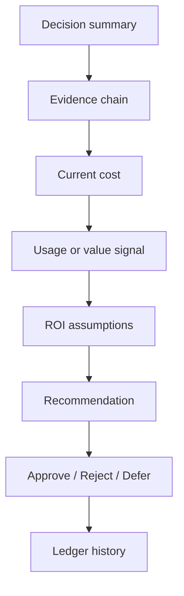

Required blocks:
- decision summary,
- timeline,
- evidence,
- current cost,
- usage or value signal,
- ROI assumptions,
- recommendation,
- approval, rejection or deferral controls,
- ledger history for this Decision ROI Case.

Detailed behavior for this screen is defined in `docs/product/29_Decision_Review_Workspace_Screen_Contract.md`.

## What Each Stakeholder Understands

| Stakeholder | What they care about | IMPERATOR answer |
|---|---|---|
| CTO / VP Engineering | Which action should we approve? | Evidence-backed recommendation with risk and confidence. |
| Platform Engineering | What changed and who owns it? | Jira -> GitHub -> AWS -> AI evidence chain. |
| FinOps / CFO | Where is recoverable spend? | Current cost, annualized saving and assumptions. |
| Security / Compliance | Can we prove who approved what? | Decision Ledger with immutable evidence snapshots. |
| Founder / Investor | Why this can become a platform? | Each reviewed decision becomes reusable enterprise context. |

## What Makes IMPERATOR Different

IMPERATOR is not:
- a generic dashboard,
- a cloud cost tool only,
- an observability platform,
- a SIEM,
- a GRC workflow platform,
- an autonomous executor.

IMPERATOR is:

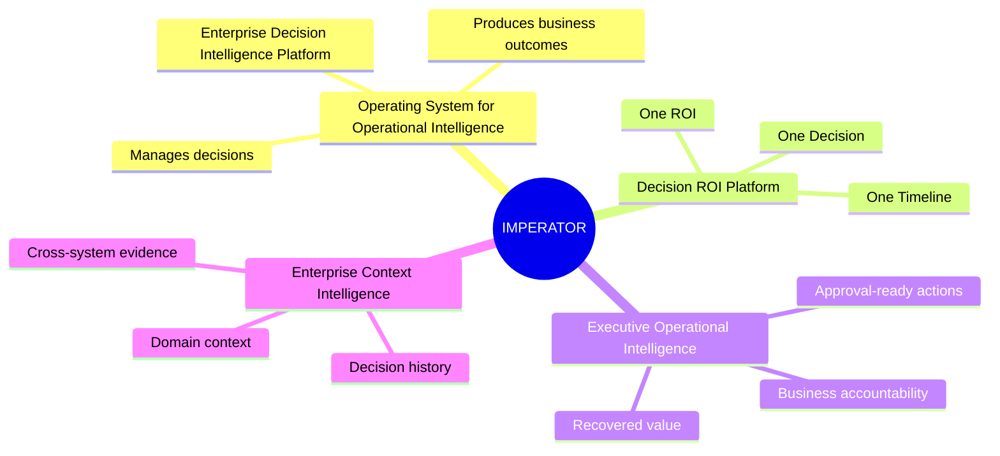

## Why It Can Become a Platform Later

The first wedge is narrow, but the underlying asset compounds.

Every reviewed decision creates:
- evidence,
- ownership,
- cost history,
- approval history,
- result history,
- reusable context.

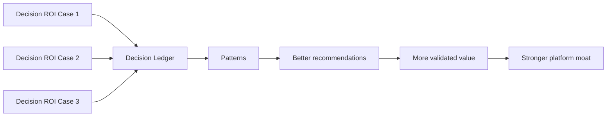

The long-term platform can expand into:
- executive workspace,
- business value reporting,
- policy and governance review,
- more integrations,
- public API,
- SDKs,
- AI explanations and semantic search.

But only after the first paid workflow proves repeatable ROI.

## 30-Day Pilot Script

Use this sequence in customer discovery or pilot design.

| Day range | Action | Output |
|---|---|---|
| Days 1-3 | Select one expensive AI/cloud decision. | Candidate Decision ROI Case. |
| Days 4-10 | Reconstruct Jira -> GitHub -> AWS -> AI chain. | Timeline and evidence pack. |
| Days 11-15 | Calculate current monthly cost and usage signal. | ROI assumptions. |
| Days 16-20 | Produce one recommendation. | Approval-ready action. |
| Days 21-25 | Review with CTO, Platform and FinOps. | Approve, reject or defer. |
| Days 26-30 | Record ledger entry and plan result validation. | Accountability record. |

## Explanation Talk Track

Use this short version when presenting live:

1. Companies approve technology decisions, but after launch the business context fragments across Jira, GitHub, AWS and AI providers.
2. IMPERATOR reconstructs one decision as a Decision ROI Case.
3. The case shows why the decision exists, who implemented it, what it costs now, what usage exists and what recovery action is available.
4. The MVP focuses on one AI/cloud spend recovery action: AI model downgrade or model change.
5. The first screen is not a generic dashboard. It is a Decision Review Workspace.
6. IMPERATOR recommends; the company approves, rejects or defers.
7. The Decision Ledger records the evidence, ROI assumptions and result so the company builds decision accountability over time.

## Success Criteria

The MVP is working if:
- 3 real customer decisions can be reconstructed,
- 2 recommendations are judged approval-ready,
- 1 recommendation is approved by CTO or VP Engineering after FinOps review,
- 1 measurable monthly saving or avoided cost is identified,
- a technical owner trusts the evidence,
- an economic buyer understands the ROI,
- the buyer asks to review more decisions.

## Final Mental Model

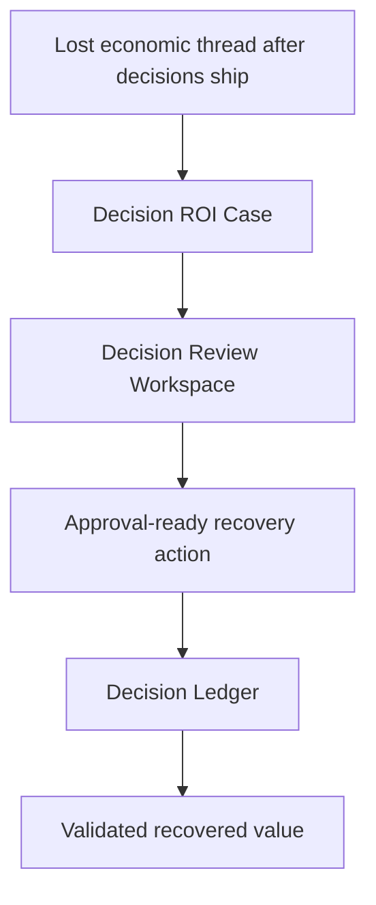

**IMPERATOR is the system that turns shipped decisions into reviewable economic objects.**
