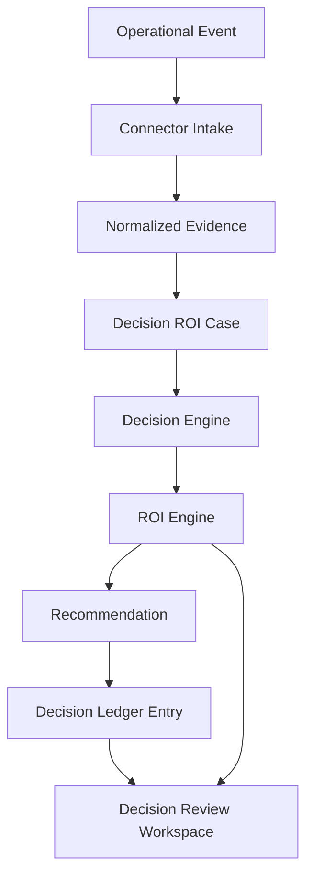

# 24 — MVP Vertical Slice

## Purpose

Define the first end-to-end MVP slice for IMPERATOR without creating implementation code.

This document turns the platform vision into one demonstrable product path:

**Event -> Connector -> Decision Engine -> ROI Engine -> Recommendation -> Decision Ledger -> Decision Review Workspace**

It is a Phase 0 planning artifact. It does not authorize services, connectors, databases, API handlers, infrastructure or executable code.

## Canonical References

- `docs/product/20_MVP_Decision_ROI_Platform_Blueprint.md`
- `docs/product/CORE_DOMAIN_MODEL.md`
- `docs/product/DECISION_LEDGER_V2.md`
- `docs/product/API_SPECIFICATION.md`
- `docs/product/25_MVP_ROI_Slice.md`
- `docs/product/26_Manual_Evidence_Pack_AI_Onboarding_Assistant.md`
- `docs/product/27_MVP_Acceptance_Test_Plan.md`
- `docs/product/28_Identity_Access_Approval_Model.md`
- `docs/product/29_Decision_Review_Workspace_Screen_Contract.md`
- `docs/architecture/21_Technical_Architecture_Context.md`
- `docs/architecture/24_MVP_Project_Structure.md`

## MVP Slice Name

**AI Onboarding Assistant Recovery**

## Slice Thesis

The first defendable MVP should prove that IMPERATOR can transform scattered operational evidence into one reviewable business decision with measurable financial impact.

The slice should answer:

> This AI onboarding assistant costs X today, has Y usage signal, and has one approval-ready action that can recover Z per year.

## Scope Rule

One decision only.

One timeline only.

One ROI view only.

One recommendation only.

One ledger history only.

## Scenario

Product approved a business decision:

**Create an AI assistant for customer onboarding.**

Engineering implemented it through GitHub.

The feature runs on AWS.

The assistant uses OpenAI or Anthropic Claude.

After launch, the company wants to know whether the decision is still worth its cost.

## MVP Input Domains

| Domain | MVP source | What it proves |
|---|---|---|
| Business Context | Jira or manual pilot record | why the decision exists, who requested it, who owns it |
| Code & Deployment | GitHub or manual pilot record | who implemented it, what changed, when it shipped |
| Infrastructure & Cost | AWS export or manual pilot record | what resources run, what they cost, how they are used |
| AI Consumption | OpenAI + Anthropic Claude export or manual pilot record | which model is used, token/request volume, AI cost |

Manual pilot records are allowed in Phase 0 and early validation.

Automatic production capture is not part of this slice.

## Conceptual Flow

## Slice Objects

### 1. Operational Event

Raw signal from an external system.

Examples:
- Jira ticket created or completed,
- GitHub pull request merged,
- AWS Lambda cost observed,
- OpenAI or Claude usage recorded.

Operational Events are not business truth yet.

### 2. Connector Intake

Conceptual intake step that preserves source identity and raw meaning.

For MVP planning, this can be manual or file-based.

Connector Intake must preserve:
- source system,
- source object ID,
- source timestamp or period,
- source actor when available,
- short source summary,
- sensitivity hint.

### 3. Normalized Evidence

Trusted product-level fact derived from an Operational Event.

Examples:
- Jira ticket says the assistant was requested to reduce onboarding time,
- GitHub PR #184 implemented the assistant,
- AWS Lambda cost is EUR410/month,
- AI usage costs EUR1,930/month,
- active usage is low relative to cost.

### 4. Decision ROI Case

The central object of the slice.

Minimum fields:
- decision title,
- business owner,
- technical owner,
- approver,
- timeline,
- evidence list,
- current monthly cost,
- usage or value signal,
- ROI assumptions,
- recommendation,
- ledger state.

### 5. Decision Engine

Product capability that correlates evidence, builds context and prepares a recommendation.

For this slice, it should not imply a separate microservice.

Minimum responsibilities:
- link evidence to one Decision ROI Case,
- identify the decision lifecycle stage,
- determine whether the case is review-ready,
- prepare recommendation rationale.

### 6. ROI Engine

Conceptual calculation layer.

Minimum outputs:
- current monthly cost,
- estimated monthly recovery,
- estimated annualized recovery,
- assumptions used,
- confidence level,
- risk level.

Example:

| Metric | Example |
|---|---:|
| Current monthly cost | EUR2,340 |
| Estimated monthly recovery | EUR1,620 |
| Estimated annualized recovery | EUR19,440 |
| Confidence | 92% |
| Risk | Low |

### 7. Recommendation

The slice should produce one approval-ready recommendation.

Primary recommendation:

**Downgrade or change AI model.**

Recommendation must include:
- reason,
- evidence,
- expected saving,
- risk,
- confidence,
- owner,
- approver,
- approval path.

### 8. Decision Ledger Entry

The ledger records the review outcome.

The ledger depends on evidence, ROI and assumptions snapshots. It records accountability after the case can be reviewed; it must not become the component that calculates ROI.

Minimum ledger events for the slice:
- recommendation created,
- recommendation approved, rejected or deferred,
- implementation marked if the customer acts,
- result validated later if saving is observed.

Ledger must preserve:
- evidence snapshot,
- ROI snapshot,
- assumptions snapshot,
- actor,
- timestamp,
- state,
- reason.

### 9. Decision Review Workspace

The first product surface.

It should answer:

**Can we trust and approve this recovery action?**

Minimum blocks:
- decision summary,
- timeline,
- evidence chain,
- current cost,
- usage or value signal,
- ROI assumptions,
- recommendation,
- approve / reject / defer controls,
- ledger history.

## Slice Timeline

## Acceptance Criteria

The vertical slice is complete when it can demonstrate:

1. A real or realistic operational event becomes normalized evidence.
2. Evidence is attached to one Decision ROI Case.
3. The case has a readable timeline.
4. The case exposes current cost and usage or value signal.
5. The ROI view shows assumptions, not only a number.
6. One recommendation is approval-ready.
7. Approval, rejection or deferral can be represented in the Decision Ledger.
8. Estimated saving and realized saving are separated.
9. The Decision Review Workspace can explain the case to a CTO, Platform owner and FinOps owner.
10. The demo does not require broad connector coverage, autonomous execution, policy automation or AI orchestration.

## Out of Scope

Do not include in this slice:
- multiple customers,
- multiple tenants,
- broad connector marketplace,
- Slack, Microsoft 365, Salesforce, Azure, GCP, Azure OpenAI, Google Gemini or Mistral,
- negative-ROI feature analysis,
- duplicated service or agent consolidation,
- autonomous infrastructure execution,
- public API,
- SDKs,
- Kafka,
- Kubernetes,
- Terraform,
- graph database,
- vector database,
- policy engine,
- full workflow engine.

## Demo Alignment

The existing demo already contains useful future-facing surfaces:

- `demos/executive_dashboard_demo/index.html`
- `demos/executive_dashboard_demo/decision_detail.html`
- `demos/executive_dashboard_demo/decision_ledger.html`
- `demos/executive_dashboard_demo/business_value.html`
- `demos/executive_dashboard_demo/integrations.html`

For this vertical slice, the most important surface is:

**Decision Detail / Decision Review Workspace**

Executive Workspace, standalone Decision Ledger, Business Value and Integrations remain useful for storytelling and expansion, but they should not define the first build scope.

## Pre-Code Artifacts To Prepare

Before implementation, prepare these as documentation or validation assets:

1. One sample Decision ROI Case narrative.
2. One evidence table for Jira, GitHub, AWS and AI usage.
3. One ROI assumptions table.
4. One recommendation rationale.
5. One ledger state sequence.
6. One screen-level outline for Decision Review Workspace.
7. One acceptance checklist for TFG/startup defense.

These artifacts may live in docs or research templates. They should not require runnable services.

The first evidence artifact now lives in `docs/product/26_Manual_Evidence_Pack_AI_Onboarding_Assistant.md`.

The acceptance test plan now lives in `docs/product/27_MVP_Acceptance_Test_Plan.md`.

The identity, access and approval model now lives in `docs/product/28_Identity_Access_Approval_Model.md`.

The first screen contract now lives in `docs/product/29_Decision_Review_Workspace_Screen_Contract.md`.

## TFG Defense Angle

The slice is defensible academically because it demonstrates:

- integration of heterogeneous operational signals,
- domain modeling around business decisions,
- evidence lineage,
- ROI reasoning,
- human approval model,
- immutable decision record,
- measurable business outcome.

## Startup Defense Angle

The slice is credible commercially because it demonstrates:

- a clear buyer pain,
- a narrow paid wedge,
- measurable savings,
- an approval-ready action,
- multi-stakeholder value,
- a path from one decision to a repeatable platform.

## Next Phase Gate

Do not begin implementation until this vertical slice is reviewed against:

- `docs/product/CORE_DOMAIN_MODEL.md`,
- `docs/product/API_SPECIFICATION.md`,
- `docs/product/DECISION_LEDGER_V2.md`,
- `docs/product/25_MVP_ROI_Slice.md`,
- `docs/product/27_MVP_Acceptance_Test_Plan.md`,
- `docs/product/28_Identity_Access_Approval_Model.md`,
- `docs/product/29_Decision_Review_Workspace_Screen_Contract.md`,
- `docs/architecture/24_MVP_Project_Structure.md`,
- `docs/architecture/21_Technical_Architecture_Context.md`.

If the slice cannot be explained without adding new systems, engines or surfaces, the MVP is still too broad.
