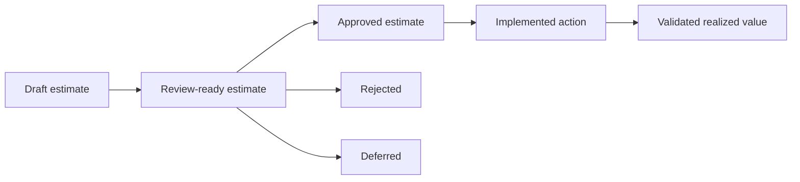

# 25 — MVP ROI Slice

## Purpose

Define the ROI slice for the first IMPERATOR MVP without creating implementation code.

This document explains how the MVP should calculate, explain and validate ROI for one Decision ROI Case.

It is a Phase 0 planning artifact. It does not define SQL, code, APIs, services, dashboards or production analytics.

## Canonical References

- `docs/product/20_MVP_Decision_ROI_Platform_Blueprint.md`
- `docs/product/24_MVP_Vertical_Slice.md`
- `docs/product/CORE_DOMAIN_MODEL.md`
- `docs/product/DECISION_LEDGER_V2.md`
- `docs/business/04_Value_Proposition.md`
- `docs/business/16_Sales_Narrative_and_Commercial_Case.md`
- `docs/architecture/DATABASE_MODEL.md`

## Slice Goal

The ROI slice must answer one executive question:

> What does this decision cost today, what can be recovered, under which assumptions, and what value was later validated?

The MVP must expose ROI as an explainable business view, not as a black-box score.

## ROI Principle

Every ROI number must have:

- evidence,
- assumption,
- period,
- owner,
- confidence,
- risk,
- ledger state.

If one of these is missing, the ROI claim is not approval-ready.

## MVP ROI Scope

### In Scope

- current monthly cost,
- estimated monthly recovery,
- estimated annualized recovery,
- manual investigation labor recovery,
- usage or value proxy,
- confidence,
- risk,
- assumptions,
- variance between estimated and realized value,
- ledger-backed result validation.

### Out of Scope

- universal revenue attribution,
- full P&L attribution,
- negative-ROI feature portfolio ranking,
- duplicated service or agent consolidation,
- automatic provider-side execution,
- forecasting models,
- AI-generated financial advice,
- accounting-grade financial reporting,
- board-level realized value aggregation before validated outcomes exist.

## ROI Object

The ROI View belongs to one Decision ROI Case.

Minimum conceptual fields:

| Field | Meaning |
|---|---|
| `decision_roi_case_id` | Decision ROI Case being evaluated |
| `period` | month, quarter or custom pilot period |
| `current_monthly_cost` | observed current monthly cost |
| `projected_monthly_cost_after_action` | expected cost after recommendation |
| `estimated_monthly_recovery` | monthly cost reduction estimate |
| `estimated_annualized_recovery` | monthly recovery multiplied by 12 |
| `manual_reconstruction_cost_before` | baseline effort cost before IMPERATOR |
| `manual_reconstruction_cost_after` | pilot assessment effort cost |
| `labor_recovery_per_case` | avoided manual reconstruction cost |
| `usage_signal` | adoption, requests, active users or similar evidence |
| `value_signal` | available business value proxy |
| `assumptions` | explicit assumptions used |
| `confidence` | trust level based on evidence completeness |
| `risk` | business or technical risk of the recommendation |
| `estimated_saving` | value at recommendation time |
| `realized_saving` | value after implementation and validation |
| `variance` | realized minus estimated |

## MVP Formula Set

These formulas are conceptual and should be explainable in plain language.

### Current Monthly Cost

```text
current_monthly_cost =
  infrastructure_monthly_cost
  + ai_monthly_cost
  + allocated_operational_cost_if_available
```

For the first slice, the default is:

```text
current_monthly_cost = AWS monthly cost + AI monthly cost
```

### Estimated Monthly Recovery

```text
estimated_monthly_recovery =
  current_monthly_cost
  - projected_monthly_cost_after_action
  - monthly_transition_cost_if_any
```

If transition cost is unknown, it must be listed as an assumption.

### Estimated Annualized Recovery

```text
estimated_annualized_recovery =
  estimated_monthly_recovery * 12
```

### Manual Labor Recovery

Use the canonical pilot assumptions from `docs/business/04_Value_Proposition.md`.

```text
labor_recovery_per_case =
  baseline_investigation_cost
  - pilot_assessment_cost
```

Canonical values:

| Assumption | Value |
|---|---:|
| Fully loaded engineering cost | EUR70/hour |
| Baseline investigation effort | 6 people x 2 hours = 12 hours |
| Baseline investigation cost | EUR840 |
| Pilot target assessment effort | 1 person x 30 minutes = 0.5 hours |
| Pilot target assessment cost | EUR35 |
| Labor recovery per reconstructed decision | EUR805 |

### Realized Recovery

```text
realized_recovery =
  observed_baseline_cost
  - observed_post_action_cost
  - actual_transition_cost
```

Realized recovery must be recorded through Decision Ledger result validation.

Estimated recovery must not be silently converted into realized value.

## Example ROI Case

Scenario:

**AI Onboarding Assistant Recovery**

### Evidence Inputs

| Evidence | Example |
|---|---|
| Business decision | Jira ticket: create AI assistant for customer onboarding |
| Technical implementation | GitHub PR #184 |
| Infrastructure cost | AWS Lambda and related resources: EUR410/month |
| AI cost | OpenAI/Claude usage: EUR1,930/month |
| Usage signal | 17 active users |
| Recommendation | Downgrade or change AI model |

### Estimated ROI

| Metric | Example |
|---|---:|
| AWS monthly cost | EUR410 |
| AI monthly cost | EUR1,930 |
| Current monthly cost | EUR2,340 |
| Projected monthly cost after model change | EUR720 |
| Estimated monthly recovery | EUR1,620 |
| Estimated annualized recovery | EUR19,440 |
| Labor recovery per reconstruction | EUR805 |
| Confidence | 92% |
| Risk | Low |

### Business Interpretation

The decision is approval-ready if:

- the cost evidence is trusted,
- usage is low enough to justify optimization,
- model quality risk is acceptable,
- the owner and approver are clear,
- assumptions are visible,
- the ledger can preserve the decision state.

## ROI Confidence Model

Confidence should reflect evidence completeness, not AI certainty.

Suggested MVP weighting:

| Evidence area | Weight |
|---|---:|
| Business context evidence | 15% |
| GitHub implementation evidence | 15% |
| AWS cost evidence | 25% |
| AI usage/cost evidence | 25% |
| Usage or value signal | 15% |
| Owner and approver clarity | 5% |

Confidence must be lowered if:

- source data is stale,
- owner is unknown,
- usage signal is weak,
- cost is estimated instead of observed,
- assumptions are not validated by the customer.

## ROI Risk Model

Risk should explain why a recommendation may be unsafe to approve.

MVP risk dimensions:

| Risk | Question |
|---|---|
| Quality risk | Could the model downgrade harm output quality? |
| User risk | Could active users be disrupted? |
| Business risk | Could the feature support an important workflow despite low usage? |
| Technical risk | Could the change require non-trivial engineering work? |
| Evidence risk | Is the data incomplete, stale or manually estimated? |

Risk values:
- Low
- Medium
- High

High-risk recommendations should be deferred unless stronger evidence exists.

## ROI States

ROI should move through clear states:



| State | Meaning |
|---|---|
| Draft estimate | early calculation, not ready for approval |
| Review-ready estimate | evidence and assumptions are visible |
| Approved estimate | approver accepted action under current assumptions |
| Implemented action | company marked action as implemented outside IMPERATOR |
| Validated realized value | post-action evidence confirms actual value |
| Rejected | approver rejected the recommendation |
| Deferred | more evidence or later review is needed |

## Ledger Integration

The ROI slice depends on Decision Ledger v2.

Ledger must capture:

- ROI snapshot at recommendation time,
- assumptions snapshot,
- evidence snapshot,
- approved, rejected or deferred state,
- implementation marker,
- realized saving when validated,
- variance versus estimate.

### Estimated vs Realized Rule

Estimated recovery can appear in the Decision Review Workspace.

Realized recovery can appear in Business Value only after:

1. action is marked implemented,
2. validation period is defined,
3. post-action evidence exists,
4. realized saving is recorded in the ledger.

## Decision Review Workspace ROI Blocks

The MVP surface should show:

| Block | Content |
|---|---|
| Current cost | monthly cost split by AWS and AI usage |
| Recovery estimate | monthly and annualized recovery |
| Assumptions | pricing, usage, period and transition assumptions |
| Evidence | source references and confidence contributors |
| Risk | quality, user, business, technical and evidence risk |
| Recommendation | action, owner, approver and approval path |
| Ledger | approval state and immutable ROI snapshot |

## Acceptance Criteria

The ROI slice is complete when:

1. Current monthly cost is explainable.
2. AI cost and AWS cost are separated.
3. Estimated monthly recovery is visible.
4. Estimated annualized recovery is visible.
5. Labor recovery is separated from direct spend recovery.
6. Every calculation exposes assumptions.
7. Confidence is based on evidence completeness.
8. Risk is explained in business language.
9. Approval preserves ROI, evidence and assumptions snapshots.
10. Realized value is recorded only after result validation.

## Anti-Patterns

Avoid:

- showing ROI as a single unexplained percentage,
- mixing estimated and realized savings,
- hiding assumptions,
- treating low usage as automatic negative ROI,
- claiming guaranteed savings,
- counting Business Value before ledger validation,
- using AI reasoning as financial proof,
- requiring full production integrations before the first ROI proof.

## Next Artifact

The next useful Phase 0 artifact after this ROI slice is:

**Manual Evidence Pack for AI Onboarding Assistant Recovery**

It should describe the evidence table that will feed:

- Decision ROI Case,
- ROI View,
- Recommendation,
- Decision Ledger snapshots.

Do not create executable fixtures or loaders until implementation is explicitly approved.
