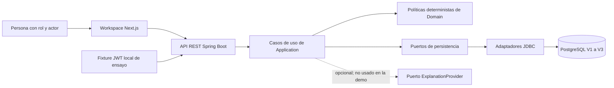
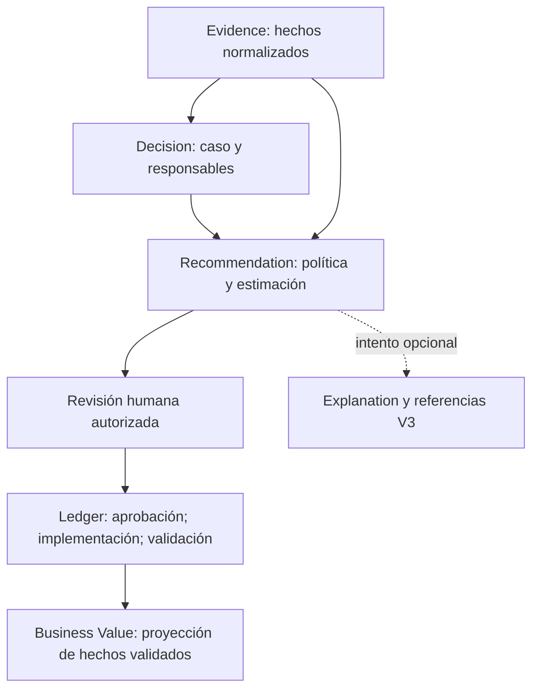

# IMPERATOR — Memoria del MVP local

Estado: **borrador académico desarrollado el 07/10/2026**. Pendientes la plantilla del centro, los datos de portada, la revisión del tutor, el SHA aceptado y la defensa narrada. Las pruebas citadas se ejecutaron el 06/10/2026; esta memoria no presenta nuevas ejecuciones.

## Resumen

IMPERATOR aborda la dificultad de reconstruir una decisión operativa: qué hechos la justificaron, qué política produjo la recomendación, quién la autorizó y qué valor se observó después. El resultado implementado es un monolito modular Java con interfaz Next.js, API REST y persistencia PostgreSQL. El caso `DRC-AOA-001` utiliza treinta evidencias sintéticas y una política determinista. La revisión humana y el registro de hechos ordenados conectan la recomendación con una proyección de valor económico.

El MVP se ha validado localmente mediante pruebas unitarias, integración con PostgreSQL, pruebas de interfaz y un ensayo Docker con la API real. Se documentan autenticación, autorización por rol y actor, migraciones, persistencia y recuperación. La generación de explicaciones está implementada y probada sin una llamada real a Bedrock. AWS constituye una arquitectura objetivo, sin despliegue ni coste real medido. La seguridad incluye una aceptación temporal, local y sintética de 23 CVE residuales sobre imágenes concretas, y una disposición independiente que mantiene abierto el riesgo de `braces` en desarrollo.

Palabras clave: trazabilidad, gobernanza de decisiones, arquitectura hexagonal, PostgreSQL, RBAC, DevSecOps, IA responsable.

## 1. Problema, usuarios y objetivo

Una recomendación aislada no permite demostrar cómo se obtuvo ni quién asumió la responsabilidad de aplicarla. Tampoco distingue un ahorro estimado de un resultado validado. El problema tratado consiste en mantener esa relación a través del ciclo completo de una decisión.

El objetivo general es implementar y evaluar una aplicación reproducible localmente, con reglas de negocio independientes de sus proveedores, autoridad humana y evidencias verificables. La definición formal de objetivos `TFG-O-01` a `TFG-O-09` se conserva en el [alcance académico](01_ACADEMIC_SCOPE.md).

El caso incluye cuatro roles: `ADMIN`, `PLATFORM_ENGINEER`, `FINANCE` y `AUDITOR`. El administrador importa y compone el caso y, como aprobador asignado de esta demo, aprueba o rechaza. El responsable técnico registra la implementación; el responsable financiero valida el resultado; el auditor consulta sin obtener autoridad de escritura. La autorización también comprueba la identidad del actor y la secuencia de hechos: disponer del rol adecuado no permite sustituir al responsable asignado. `ADMIN` como aprobador es una simplificación de esta fase, no un modelo permanente de autoridad empresarial.

## 2. Alcance y método

Se incluye un único caso, un monolito modular, una interfaz existente, treinta registros sintéticos, una recomendación determinista y un Ledger. No se añaden funcionalidades para ampliar la demostración. Quedan fuera de esta entrega local los datos reales, la exposición pública, el IdP externo, la ejecución de Bedrock y el despliegue AWS.

El trabajo sigue una secuencia de requisitos, implementación, pruebas, evidencias y decisión. A-S1 remedió exclusivamente los hallazgos autorizados. A-S2 registró el resultado técnico y la decisión explícita sobre el riesgo residual. A-S3 prepara la revisión de la versión y vincula los resultados existentes con fuente e imágenes. A-S4 prepara la memoria y ensaya su explicación. Un documento preparado no equivale a una prueba ejecutada ni a una aprobación.

Se distinguen tres identidades: el SHA del código, la huella de los archivos usados y los digests de las imágenes ejecutadas. Un commit nuevo de documentación no cambia por sí mismo las imágenes ni extiende una aceptación de seguridad. La [revisión de versión](A_S3_EVIDENCE_VERSIONING.md) y el [gate de cierre](10_LOCAL_MVP_RELEASE_GATE.md) explican qué comprobaciones siguen pendientes.

## 3. Requisitos y criterios de aceptación

| Requisito       | Resultado evaluado                                            | Evidencia concreta                                                                                                        |
| --------------- | ------------------------------------------------------------- | ------------------------------------------------------------------------------------------------------------------------- |
| `TFG-RF-01–03`  | Importar hechos, componer el caso y calcular la recomendación | [Ensayo real API/UI](evidence/2026-10-06-r21-r22/docker/capture/rehearsal.json), pruebas de dominio y API                 |
| `TFG-RF-04–06`  | Autoridad humana, secuencia del Ledger y valor realizado      | [Persistencia y Ledger](evidence/2026-10-06-r21-r22/docker/persistence.json) y ensayo real                                |
| `TFG-RF-07`     | Presentación del caso por rol                                 | [Capturas](evidence/2026-10-06-r21-r22/docker/capture/01-deterministic-recommendation.png) y pruebas frontend             |
| `TFG-RF-08`     | Explicación opcional sin autoridad de negocio                 | [E-AI-01](04_EVIDENCE_REGISTER.md), pruebas offline; llamada real pendiente                                               |
| `TFG-NFR-02–04` | JWT/RBAC, protección de secretos y PostgreSQL V3              | Ensayo, [escaneos](evidence/2026-10-06-r21-r22/scans/summary.json) y persistencia                                         |
| `TFG-NFR-05–07` | Observabilidad, contenedores y cadena de suministro           | [Observabilidad](evidence/2026-10-06-r21-r22/docker/observability/verification.json), manifests y decisiones de seguridad |
| `TFG-CLOUD-01`  | Justificar una arquitectura AWS objetivo                      | [Arquitectura](05_ARCHITECTURE.md), Terraform y validación offline histórica                                              |

La [matriz completa](03_TRACEABILITY_MATRIX.md) conserva objetivos, competencias y requisitos cloud no ejecutados. Las capturas ayudan a explicar; las aserciones, informes y hashes sustentan la aceptación.

## 4. Arquitectura y modelo de información

El diagrama representa el ensayo local. Los adaptadores GitHub/AWS existen en el código, pero no se invocan en esta demostración. La dirección de dependencias permite probar el dominio sin Spring, HTTP, JDBC o servicios externos. El monolito reduce despliegues y coordinación para el alcance de un único caso; no demuestra escalado independiente por servicio.

Este segundo diagrama es conceptual, no un esquema físico exhaustivo. Las tablas de asociación mantienen las referencias de evidencias. Los hechos del Ledger incluyen relaciones de orden y evidencias vinculadas. Business Value es una consulta/proyección; el diagrama no implica una tabla nueva ni una escritura de negocio realizada por IA. Las [migraciones](../../database/migrations/) son la fuente del modelo físico.

V3 incorpora `recommendation_explanations`, `recommendation_explanation_evidence` y `recommendation_explanation_assumptions`. Las restricciones validan estados, referencias y contenido. La identidad de aplicación dispone de lectura/inserción y carece de actualización/borrado en las tablas append-only verificadas. La identidad propietaria usada para migraciones se mantiene separada. Esto protege frente a escrituras de la aplicación; no convierte el Ledger en prueba criptográfica contra un administrador de base de datos.

## 5. Implementación y caso canónico

La pila conservada es Java 21, Spring Boot, Next.js, PostgreSQL 18.6, Flyway y Docker. Los números completos de dependencias y bases se toman de los archivos versionados y manifests, evitando presentar una versión publicada posteriormente como la ejecutada.

El ensayo importa treinta evidencias sintéticas: veintiocho previas a la decisión y dos posteriores a la acción. Compone `DRC-AOA-001` con el conjunto previo; los dos registros posteriores sustentan implementación y validación. La política produce una recomendación `MODEL_CHANGE`. Su resultado estimado es 19.440,00 EUR; después de aprobación, implementación y validación del resultado, la proyección realizada sintética es 18.960,00 EUR, con una variación de −480,00 EUR. Las cifras son valores del caso de evaluación; no constituyen ahorros reales de una empresa ni métricas de rentabilidad observadas en producción.

La aprobación se realiza en la interfaz. La implementación y la validación financiera del ensayo utilizan comandos autenticados de la API para enlazar evidencias posteriores, y luego se leen desde la UI sin interceptar las respuestas. La evidencia actual no demuestra la selección de esos registros previamente no vinculados mediante el selector de la interfaz. Esta limitación se conserva y no se amplía la UI para ocultarla.

## 6. Seguridad y decisión de riesgo

JWT y RBAC aplican controles de autenticación, permisos de ruta y autoridad del actor. El ensayo documenta un acceso sin autenticación denegado y un auditor sin autoridad de escritura. Las pruebas de secuencia comprueban que los hechos de negocio se registran en el orden permitido.

Las imágenes inspeccionadas conservan sus identidades OCI y medidas de endurecimiento: identidades de servicio, filesystem de solo lectura donde está configurado, permisos reducidos y `no-new-privileges`. PostgreSQL requiere un volumen y capacidades concretas para operar. No se presenta el conjunto como un sistema sin superficie de ataque o sin vulnerabilidades.

R-17, R-19, R-21 y R-22 documentan correcciones acotadas. El resultado de los escaneos sobre las imágenes aprobadas es cero High/Critical corregibles y cero secretos. El informe completo conserva 115 filas paquete/CVE correspondientes a 23 CVE distintas en frontend y PostgreSQL; estos residuos no se esconden por el filtro del gate.

R-20 acepta condicionalmente esos 23 CVE para los digests aprobados, únicamente en entorno local con datos sintéticos. No los declara inexplotables. La aceptación termina el **09/10/2026 a las 00:00 Europe/Madrid**, equivalente a **08/10/2026 22:00 UTC**, y no se renueva ni transfiere automáticamente. También puede invalidarse antes por cambios o un fix disponible, conforme al registro aprobado.

R-23 mantiene `braces` como **OPEN / NO FIX AVAILABLE**, separado de R-20. El paquete aparece en tooling de desarrollo y no como paquete en la imagen de producción inspeccionada. La ausencia del paquete no es una prueba universal de ausencia de cualquier código equivalente. El advisory inspeccionado no publicaba un fix; eso es una observación fechada, no una garantía futura. Las condiciones propuestas para trabajo con repositorios/configuración no confiables no se describen como controles automatizados ya implementados.

Fuentes de estas decisiones: [aceptación exacta R-20](evidence/2026-10-06-a-s2-acceptance/r20-current-acceptance.json), [disposición R-23](evidence/2026-10-06-a-s2-acceptance/r23-approved-open-disposition.json) y [revisión individual](R20_APPLICABILITY_REVIEW.md).

## 7. IA responsable y arquitectura AWS

El proveedor de explicación recibe contexto limitado de una recomendación ya calculada. No decide la acción, cambia el ROI, autoriza una decisión ni escribe el Ledger. La validación rechaza salida inválida, referencias desconocidas y material no permitido; un fallo del proveedor no invalida el resultado determinista. La evidencia disponible es de implementación y pruebas offline. La defensa sin servicios externos explica este diseño mediante código e informes, sin simular una llamada real a Bedrock.

AWS se presenta exclusivamente como evolución: VPC, ALB, tareas ECS/Fargate, RDS, ECR, IAM/OIDC y observabilidad. La arquitectura objetivo incluye compromisos de disponibilidad: una tarea por servicio, una NAT y RDS Single-AZ. No corresponde describirla como alta disponibilidad completa. Las discrepancias de ECR, alcance de IAM y vinculación del plan permanecen en TFG-B. D101 conserva su gate externo; no se suplanta mediante los JWT locales del ensayo.

No se ha medido un coste AWS, efectuado un plan/apply ni validado rollback o teardown cloud. Esta memoria no introduce precios estimados ni ahorros de infraestructura. Si el tutor exige un despliegue cloud, el MVP local no basta para ese requisito académico y se necesita el recorrido posterior autorizado.

## 8. Evaluación y reproducibilidad

| Control del 06/10/2026      | Resultado                                                                         | Límite de interpretación                                                  |
| --------------------------- | --------------------------------------------------------------------------------- | ------------------------------------------------------------------------- |
| Backend                     | 174 unitarios y 35 integración PostgreSQL PASS                                    | Ejecución local; no CI nueva asociada al candidato                        |
| Frontend                    | 41 tests; formato, lint, tipos y build PASS                                       | No equivale a navegación de toda la aplicación real                       |
| Playwright con fixtures     | 9 PASS y 6 skips intencionales                                                    | Los skips se muestran; no se cuentan como PASS ni demuestran backend real |
| Ensayo real Docker/API/UI   | Flujo y RBAC PASS; cinco capturas                                                 | Datos sintéticos; comandos API y lecturas UI identificados                |
| Persistencia y recuperación | Tres contenedores reemplazados; datos conservados; readiness/recovery comprobados | No prueba recuperación AWS o de desastre físico                           |
| Seguridad de producción     | Fixable H/C = 0; secretos = 0                                                     | Residuos visibles bajo decisión temporal específica                       |
| Grabación técnica           | WebM 27,16 segundos, sin audio                                                    | Respaldo técnico; ensayo oral de doce minutos pendiente                   |

Los datos brutos se conservan en el [pack R-21/R-22](evidence/2026-10-06-r21-r22/README.md). El archivo de fuente exacta y el bundle Git permiten distinguir bytes originales de normalización de finales de línea. Los manifests enlazan imagen índice, plataforma amd64, configuración y capas; una etiqueta mutable no basta como identidad.

La revisión de documentación del 07/10/2026 no vuelve a ejecutar todas las pruebas. Un ensayo posterior debe comprobar caducidad, digests y precondiciones. Si Docker o la certificación de versión no están disponibles, se usa el material grabado identificándolo como reproducción de evidencia histórica; no se registra un runtime PASS nuevo.

## 9. Resultados, límites y conclusiones

El resultado local demuestra que un conjunto de hechos puede originar una recomendación reproducible, mantenerse bajo autoridad humana y producir una proyección económica rastreable. La separación del dominio, la persistencia y la verificación de permisos ofrecen argumentos técnicos concretos para defender el diseño.

Permanecen pendientes la aceptación de un SHA de entrega, la asociación efectiva de CI a ese SHA, la defensa narrada y la revisión académica. La aceptación de vulnerabilidades tiene fecha y alcance; la clasificación de aplicabilidad no prueba inexplotabilidad. La identidad externa, Bedrock real, costes y operación AWS no se han ejecutado. Estas limitaciones delimitan lo demostrado y evitan convertir preparación en certificación.

La siguiente mejora necesaria es completar la entrega y su defensa, sin nuevos upgrades ni funcionalidades. La evolución cloud se condiciona a los requisitos del tutor y a los gates de TFG-B/C/D. El MVP académico local y una release operativa del producto tienen criterios distintos.

## Referencias y anexos verificables

- [Plan y definición de terminado](00_TFG_MASTER_PLAN.md), [alcance](01_ACADEMIC_SCOPE.md) y [competencias](02_COMPETENCY_MATRIX.md).
- [Trazabilidad](03_TRACEABILITY_MATRIX.md), [registro de evidencias](04_EVIDENCE_REGISTER.md) y [arquitectura](05_ARCHITECTURE.md).
- [Gate de seguridad](TFG_A_SECURITY_CLOSURE_GATE.md), revisión R-20 y disposiciones aprobadas citadas.
- [Guion de defensa](09_DEFENSE_SCRIPT_12_MIN.md), [procedimiento A-S4](A_S4_LOCAL_DEFENSE.md) y [gate de entrega](10_LOCAL_MVP_RELEASE_GATE.md).
- Normativa, plantilla institucional y bibliografía externa exigida por el centro: **pendientes de aportar y revisar; no inventadas**.
